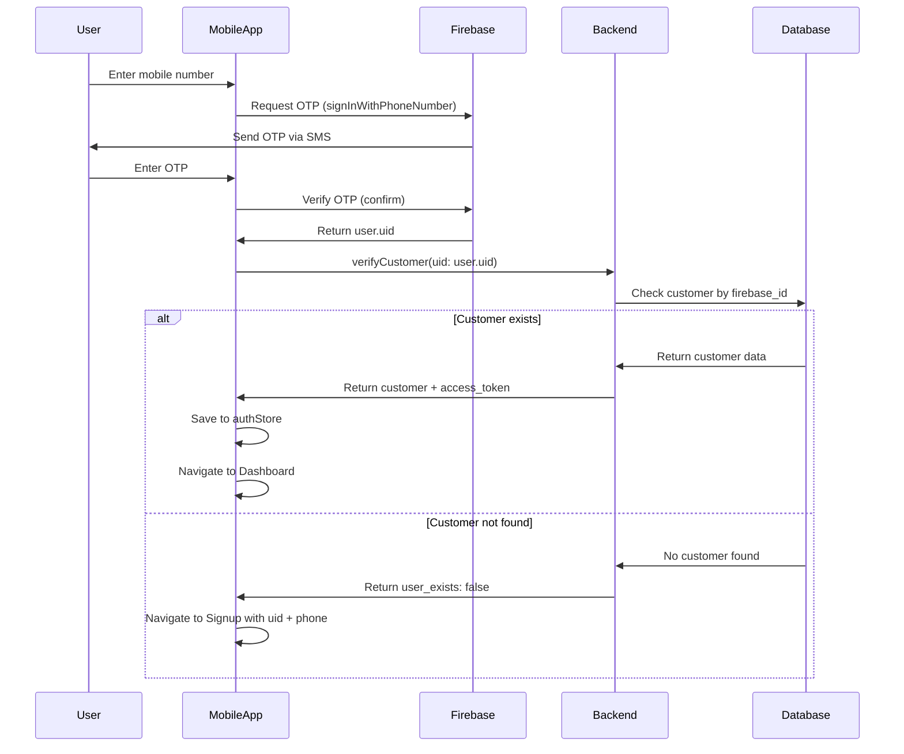

# Mobile OTP Login Flow Implementation

## Overview

Implement a mobile OTP-based authentication flow for Gateco mobile app, similar to the aspire-club reference implementation. The flow includes:

1. Mobile number input with country code selection
2. Firebase phone authentication for OTP verification
3. Backend API to check customer existence by Firebase UID
4. Conditional navigation: existing users → dashboard, new users → registration with UID

## Architecture Flow



## Backend Implementation (Completed)

### 1. Database Migration

- **File**: `gateco-be/migrations/20250120000001-add-firebase-id-to-customers.js`
- Added `firebase_id` field (STRING, nullable, unique) to Customer table
- Added index for faster lookups

### 2. Customer Model Update

- **File**: `gateco-be/api/models/Customer.js`
- Added `firebase_id` field with unique validation
- Field is nullable to support existing customers

### 3. Customer Input Type Update

- **File**: `gateco-be/api/modules/customer/inputTypes/customerInputType.js`
- Added `firebase_id` field to CustomerInputType for Create operations

### 4. Customer Type Update

- **File**: `gateco-be/api/modules/customer/types/customerType.js`
- Added `firebase_id` field to CustomerType

### 5. verifyCustomer Query

- **File**: `gateco-be/api/modules/customer/queries/customerQuery.js`
- Created `verifyCustomer` query that:
  - Accepts `firebase_id` (UID from Firebase) as parameter
  - Searches Customer table by `firebase_id`
  - If found: returns customer data + access_token
  - If not found: throws validation error with `user_exists: false` in `validationErrors`
  - Validates customer approval and status before returning
- **File**: `gateco-be/api/graphql/queries/index.js` - Exported verifyCustomer
- **File**: `gateco-be/api/graphql/index.js` - Registered verifyCustomer query

### 6. registerCustomer Mutation Update

- **File**: `gateco-be/api/modules/customer/mutations/auth.js`
- Updated to accept `firebase_id` in customer input during registration
- Stores `firebase_id` when creating new customer

## GraphQL API

### verifyCustomer Query

```graphql
query VerifyCustomer($firebase_id: String) {
  verifyCustomer(firebase_id: $firebase_id) {
    id
    shop_name
    owner_name
    email
    whatsapp_number
    secondary_number
    shop_board_photo
    vat_no
    cr_no
    baladiya_no
    is_approved
    status
    access_token
    firebase_id
    created_at
    updated_at
  }
}
```

**Response when customer exists:**

```json
{
  "data": {
    "verifyCustomer": {
      "id": "uuid",
      "shop_name": "Shop Name",
      "email": "email@example.com",
      "access_token": "jwt_token",
      ...
    }
  }
}
```

**Response when customer doesn't exist:**

```json
{
  "errors": [
    {
      "message": "Validation error",
      "extensions": {
        "validationErrors": {
          "user_exists": false
        }
      }
    }
  ]
}
```

**Note**: The mobile app should check for `validationErrors.user_exists === false` to determine if the user needs to register.

### registerCustomer Mutation (Updated)

```graphql
mutation RegisterCustomer($customer: Customer_Create!) {
  registerCustomer(customer: $customer) {
    id
    shop_name
    owner_name
    email
    firebase_id
    ...
  }
}
```

**Input includes:**

- `firebase_id` (optional): Firebase UID from mobile OTP authentication

## Mobile App Implementation (Pending)

### 1. Install Firebase Auth

- Check if `@react-native-firebase/auth` is in `package.json`
- If missing, add dependency: `yarn add @react-native-firebase/auth`

### 2. Create Mobile Login Screen

- **File**: `gateco-mob/src/screens/auth/MobileLogin/MobileLogin.tsx`
- Implement similar to `ref/aspire-club-mobile/src/views/Auth/MobileAuthLogin.js`:
  - Step 1: Mobile number input with country code selector
  - Step 2: OTP input (6 digits)
  - Firebase phone auth integration
  - Timer for OTP resend
  - Error handling

### 3. Create GraphQL Query

- **File**: `gateco-mob/src/api/graphql/auth/queries.ts` (create if doesn't exist)
- Add `VERIFY_CUSTOMER` query that accepts `firebase_id` and returns customer data with `user_exists` field

### 4. Update OTPVerification Screen

- **File**: `gateco-mob/src/screens/auth/OTPVerification/OTPVerification.tsx`
- Implement OTP verification logic:
  - Receive phone number and Firebase confirmation object from MobileLogin
  - Verify OTP with Firebase
  - On success, call `verifyCustomer` query with Firebase UID
  - Handle response: navigate to Dashboard if user exists, or Signup if not

### 5. Update Signup Screen

- **File**: `gateco-mob/src/screens/auth/Signup/Signup.tsx`
- Accept `firebase_id` and `phoneNumber` from route params
- Pre-fill phone number field if provided
- Include `firebase_id` in registration mutation

### 6. Update Navigation

- **File**: `gateco-mob/src/navigation/AuthStack.tsx`
- Add `MobileLogin` screen to AuthStack
- Update route params in `gateco-mob/src/navigation/types.ts`:
  - Add `firebase_id` and `phoneNumber` to Signup params
  - Add `phoneNumber` and `firebaseConfirmation` to OTPVerification params

### 7. Update Intro/Onboard Screen

- **File**: `gateco-mob/src/screens/auth/Intro/Intro.tsx` or Onboard screen
- Add option to choose between email/password login and mobile OTP login
- Navigate to MobileLogin for OTP flow

## Key Files to Modify

### Backend (Completed)

- ✅ `gateco-be/migrations/20250120000001-add-firebase-id-to-customers.js`
- ✅ `gateco-be/api/models/Customer.js`
- ✅ `gateco-be/api/modules/customer/inputTypes/customerInputType.js`
- ✅ `gateco-be/api/modules/customer/types/customerType.js`
- ✅ `gateco-be/api/modules/customer/queries/customerQuery.js`
- ✅ `gateco-be/api/modules/customer/mutations/auth.js`
- ✅ `gateco-be/api/graphql/queries/index.js`
- ✅ `gateco-be/api/graphql/index.js`

### Mobile (Pending)

- `gateco-mob/src/screens/auth/MobileLogin/MobileLogin.tsx` (new)
- `gateco-mob/src/screens/auth/MobileLogin/styles.ts` (new)
- `gateco-mob/src/screens/auth/OTPVerification/OTPVerification.tsx`
- `gateco-mob/src/screens/auth/Signup/Signup.tsx`
- `gateco-mob/src/api/graphql/auth/queries.ts` (new or update)
- `gateco-mob/src/navigation/AuthStack.tsx`
- `gateco-mob/src/navigation/types.ts`
- `gateco-mob/package.json` (if Firebase Auth not installed)

## Technical Considerations

1. **Firebase Setup**: Ensure Firebase project is configured with Phone Authentication enabled
2. **Error Handling**: Handle Firebase auth errors, network errors, and backend validation errors
3. **State Management**: Use existing authStore for user data persistence
4. **Security**: Firebase UID is secure and cannot be spoofed
5. **User Experience**: Show loading states, error messages, and resend OTP functionality
6. **Country Codes**: Reuse or create country code selector component similar to reference

## Testing Checklist

- [ ] Mobile number validation
- [ ] OTP sending and receiving
- [ ] OTP verification with Firebase
- [ ] Backend verifyCustomer query for existing users
- [ ] Backend verifyCustomer query for new users
- [ ] Registration with firebase_id
- [ ] Navigation flow (existing user → Dashboard, new user → Signup)
- [ ] Error handling for invalid OTP, network errors, etc.

## Migration Instructions

To apply the database migration:

```bash
cd gateco-be
npx sequelize-cli db:migrate
```

This will add the `firebase_id` column to the `customers` table.

## Reference Implementation

The implementation is based on the aspire-club reference:

- Mobile login: `ref/aspire-club-mobile/src/views/Auth/MobileAuthLogin.js`
- Backend verify: `ref/aspire-club-backend/api/graphql/queries/VerifyUser.js`
